## 🎯 Landing Platform API

Бэкенд-сервис для управления мероприятиями, пользователями, кураторами и бонусной системой.

---

## 📑 Содержание

- 🚀 Быстрый старт  
- 🏗️ Архитектура проекта  
- 🔗 Связь кураторов с мероприятиями  
- 🗃️ Созданные таблицы  
- 🧹 Каскадное удаление  
- 🧪 Возможности API  
- 📊 Excel-отчёты  
- 🌐 Импорт новостей из ВКонтакте  
- 🖼️ Сжатие изображений  
- 🧪 Примеры запросов  

---

## 🗺 Архитектура проекта



---

## 🚀 Быстрый старт

### 🔧 Настройка базы данных и миграций

```bash
dotnet ef database update --startup-project ./LendingAPI --project ./Landing.Infrastructure
```

Добавь строку подключения в `appsettings.json`:

```json
"ConnectionStrings": {
  "DefaultConnection": "Host=localhost;Port=5432;Database=landing_db;Username=postgres;Password=your_password"
}
```

---

## 🏗️ Архитектура проекта

- **ASP.NET Core Web API (.NET 8)**  
- **Entity Framework Core + PostgreSQL**  
- **JWT-аутентификация с Refresh-токенами**  
- **Роли и разграничение прав доступа** (пользователь, админ, куратор)  
- **Система баллов с транзакциями**  
- **Hangfire** — фоновые и отложенные задачи  
- **Swagger / OpenAPI** — встроенная документация  

---

## 🔗 Связь кураторов с мероприятиями

Кураторы (`User`) могут быть прикреплены к мероприятиям типа `CuratedEvent`. Связь реализована через промежуточную таблицу `UserCuratedEvents` (many-to-many).

**Модель `User`:**
```csharp
public virtual ICollection<CuratedEvent> CuratedEvents { get; set; }
```

**Модель `CuratedEvent`:**
```csharp
public virtual ICollection<User> Curators { get; set; }
```

**Fluent API конфигурация:**
```csharp
builder
    .HasMany(e => e.Curators)
    .WithMany(u => u.CuratedEvents)
    .UsingEntity<Dictionary<string, object>>(
        "UserCuratedEvents",
        j => j.HasOne<User>().WithMany().HasForeignKey("UserId").OnDelete(DeleteBehavior.Cascade),
        j => j.HasOne<CuratedEvent>().WithMany().HasForeignKey("CuratedEventId").OnDelete(DeleteBehavior.Cascade),
        j =>
        {
            j.HasKey("UserId", "CuratedEventId");
            j.ToTable("UserCuratedEvents");
        });
```

---

## 🗃️ Созданные таблицы

| Таблица                 | Назначение                                     |
|-------------------------|-----------------------------------------------|
| `Users`                 | Пользователи системы                          |
| `Events`                | Общая информация о мероприятиях              |
| `CuratedEvents`         | Мероприятия с кураторами                     |
| `UserCuratedEvents`     | Связи между кураторами и мероприятиями       |
| `UserRoles`             | Роли пользователей                           |
| `EventAttendances`      | Учёт посещаемости мероприятий                |
| `UserPointsTransactions`| Начисление и списание баллов                 |
| `RefreshTokens`         | Обновляющие JWT-токены                       |
| `News`                  | Новости и объявления                         |
| `NewsImages`            | Дополнительные изображения к новостям        |

---

## 🧹 Каскадное удаление

- При **удалении пользователя**: связи с мероприятиями (`UserCuratedEvents`) удаляются автоматически  
- При **удалении мероприятия**: все прикреплённые кураторы отвязываются  
- Очистка мусорных изображений выполняется по расписанию с помощью Hangfire  

---

## 🧪 Возможности API

✅ Регистрация и подтверждение Email  
✅ Аутентификация через JWT + Refresh Tokens  
✅ Роли: администратор, пользователь, куратор  
✅ CRUD для новостей и мероприятий  
✅ Запись на мероприятия и подтверждение явки  
✅ Назначение кураторов для мероприятий  
✅ Начисление и списание баллов  
✅ Excel-отчёты за месяц  
✅ Отложенные задачи (Hangfire):  
- Удаление мусорных файлов  
- Начисление баллов на день рождения  
✅ Импорт новостей из VK  
✅ Сжатие изображений до нужных размеров  

---

## 📊 Excel-отчёты

Администратор может сформировать отчёт за месяц:

**Лист 1:** Список пользователей  
| ФИО | Дата рождения | Email | Кол-во баллов |

**Лист 2:** Посещения мероприятий  
Структура: мероприятия по строкам, пользователи по столбцам. Если пользователь присутствовал — отмечено "✔".

Формируется с помощью **ClosedXML**.

---

## 🌐 Импорт новостей из ВКонтакте

Интеграция с группой VK: [vk.com/club230102867](https://vk.com/club230102867)

- Получение последних постов через VK API  
- Сохранение текста, изображений, вложений  
- Изображения хранятся в таблице `NewsImages`  
- Поддержка внешних ссылок и видео (при необходимости)

Настройки токена и группы указываются в конфигурации `appsettings.json`.

---

## 🖼️ Сжатие изображений

При загрузке изображений:

- Генерируются 3 версии: `512x380`, `256x190`, `128x95`
- Оригиналы хранятся вместе с миниатюрами
- Оптимизировано под быструю отдачу на фронт

Файлы не дублируются — используются префиксы/папки.

---

## 🧪 Примеры запросов

### 🔑 Авторизация

```http
POST /api/auth/login
Content-Type: application/json

{
  "email": "admin@mail.com",
  "password": "password123"
}
```

---

### 🧍 Регистрация

```http
POST /api/auth/register
Content-Type: application/json

{
  "fullName": "Иван Иванов",
  "email": "ivan@mail.com",
  "password": "password123",
  "birthdate": "2000-01-01"
}
```

---

### 📰 Создание новости (с изображениями)

```http
POST /api/news
Authorization: Bearer {token}
Content-Type: multipart/form-data

Form fields:
- Title: "Новая новость"
- Content: "Контент"
- Image: (основное изображение)
- AdditionalImages[]: (доп. изображения)
```

---

### 📥 Запись на мероприятие

```http
POST /api/events/{eventId}/register
Authorization: Bearer {token}
```

---

### ✅ Подтверждение явки (админом)

```http
POST /api/events/{eventId}/attendance/{userId}/confirm
Authorization: Bearer {admin_token}
```
